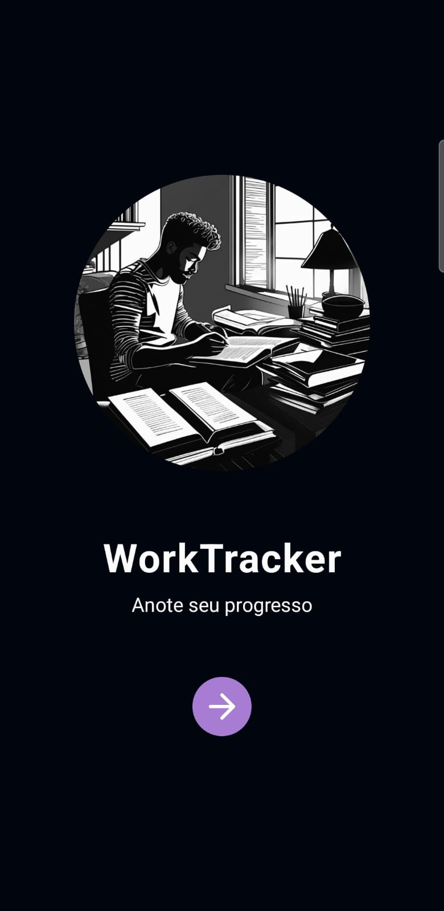
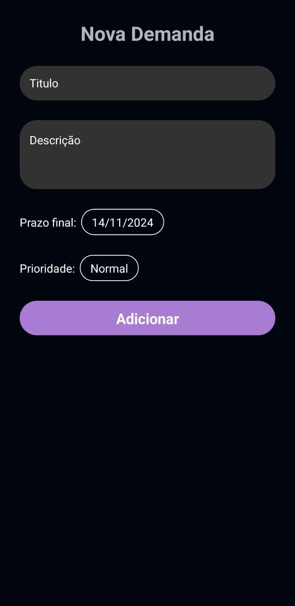

# Gerenciamento de Demandas para Trabalhador Informal

Este projeto é um aplicativo em **React Native** desenvolvido para cadastrar e gerenciar as demandas de um trabalhador informal. Ele permite acompanhar as demandas, prazos, status e detalhes das atividades realizadas pelo trabalhador. A proposta é fornecer uma ferramenta prática e acessível para organizar os pedidos de clientes, atualizar o progresso e manter um histórico das tarefas.

## Funcionalidades

- Cadastro de novas demandas com informações detalhadas.
- Edição e exclusão de demandas existentes.
- Visualização de histórico de demandas concluídas.
- Filtragem e ordenação de demandas por status.

## Imagens

